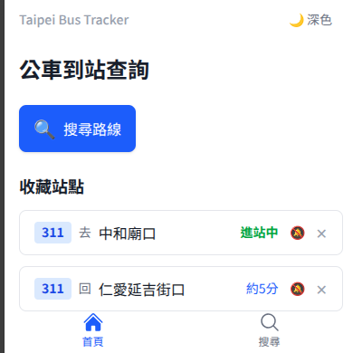
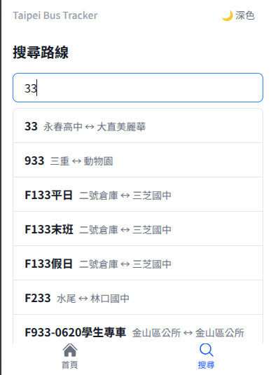
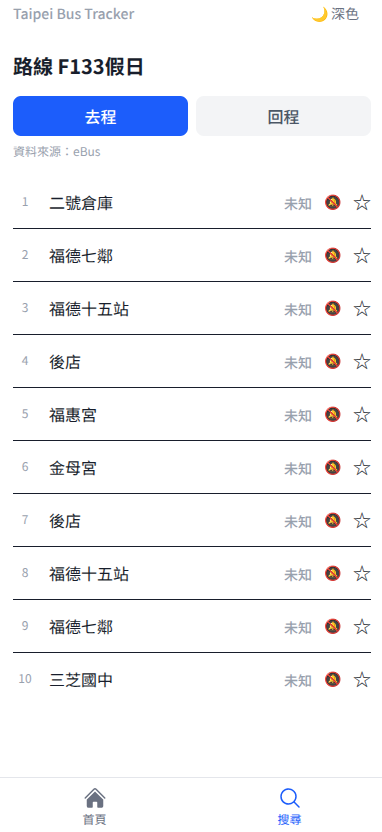
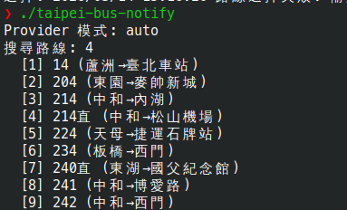
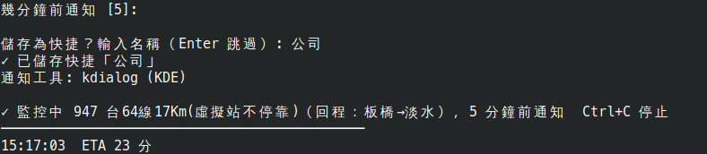
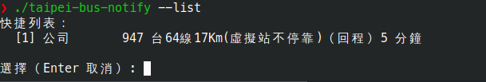

# Taipei Bus Tracker

自架的台北公車即時到站查詢工具。Go 後端 + React PWA 前端，單一 binary 部署。

> 本專案使用 [OpenSpec](https://github.com/Fission-AI/OpenSpec) 進行需求規劃與任務拆解，完整的 change 記錄可參考 [openspec/](openspec/)。

## 功能

- 路線搜尋、方向選擇、即時到站時間
- 每 15 秒自動更新
- 雙資料源 fallback（TDX 主要 + eBus 備援）
- 收藏常用路線/站點
- 到站瀏覽器通知提醒（首頁收藏可直接設定/查看）
- CLI 到站監控 + 桌面通知（Linux notify-send / kdialog）
- 深色模式
- PWA 支援（可加到手機主畫面）

## 畫面預覽

### 首頁（收藏站點）

顯示收藏的站點即時到站資訊，可直接設定/查看通知狀態。



### 路線搜尋

輸入關鍵字搜尋路線，點擊進入路線詳情。



### 路線詳情

顯示所有站點的即時到站時間，可收藏站點、設定到站通知。



### CLI 到站監控

Terminal 監控到站時間，到站時發送桌面通知。







## 環境需求

- Go 1.22+
- Node.js 20+
- npm 10+

## 快速開始

```bash
# 複製設定檔並填入 TDX credentials
cp config.example.yaml config.yaml

# 一鍵 build
make build

# 啟動
./taipei-bus
```

## 開發

```bash
# Go 後端開發
go run ./cmd/server

# React 前端開發
cd web && npm run dev

# Lint (Go + React)
make lint

# Test (Go + React)
make test

# Lint + Test
make check
```

## CLI 到站監控

除了網頁介面，也提供 CLI 工具在 terminal 監控到站時間並發送桌面通知。

### Build

```bash
make build-notify
```

### 互動模式

```bash
./taipei-bus-notify
```

依序選擇路線、方向、站點、通知閾值，完成後開始監控。結束時可儲存為快捷，下次直接使用。

### 快捷

設定儲存在 `notify.yaml`，支援以下操作：

```bash
# 直接使用已儲存的快捷
./taipei-bus-notify 上班

# 列出所有快捷（互動選擇）
./taipei-bus-notify --list

# 刪除快捷
./taipei-bus-notify --delete 上班
```

### 指定 Provider

```bash
./taipei-bus-notify --provider ebus
```

### 運作方式

- 自動偵測通知工具（notify-send > kdialog），無工具時僅 terminal 顯示
- 依 ETA 遠近自動調整輪詢頻率（60s / 30s / 15s）
- ETA 進入閾值時發送桌面通知 + 音效（需 paplay）
- Ctrl+C 停止，顯示監控統計

## 專案架構

```
cmd/
  server/       Web server（Go 後端 + 靜態檔案）
  notify/       CLI 到站監控工具
internal/
  provider/     資料源實作（TDX、eBus）
  handler/      HTTP handler + fallback 邏輯
  cache/        記憶體快取
  model/        共用資料模型
  config/       設定載入（YAML + 環境變數）
web/            React 前端（Vite + TypeScript + Tailwind）
deploy/         部署設定（systemd、nginx）
```

## API

| 端點 | 說明 | 參數 |
|------|------|------|
| `GET /api/routes/search` | 搜尋路線 | `?q=關鍵字` |
| `GET /api/routes/{routeId}/stops` | 取得站點列表 | `?direction=0\|1` |
| `GET /api/routes/{routeId}/eta` | 取得即時到站時間 | `?direction=0\|1` |

## 設定

支援 YAML config file 和環境變數，環境變數優先。

| 設定項 | 環境變數 | config.yaml key | 預設值 |
|--------|----------|-----------------|--------|
| Server Port | `BUS_PORT` | `port` | `8080` |
| TDX Client ID | `TDX_CLIENT_ID` | `tdx.client_id` | - |
| TDX Client Secret | `TDX_CLIENT_SECRET` | `tdx.client_secret` | - |
| Static Files Path | `BUS_STATIC_PATH` | `static_path` | `./static` |
| Provider Mode | `BUS_PROVIDER` | `provider` | `auto` |

TDX Client ID / Secret 需至 [TDX 運輸資料流通服務平臺](https://tdx.transportdata.tw/) 註冊帳號並申請 API 金鑰。若不想申請，可將 Provider 設為 `ebus` 使用 eBus 資料源，不需任何額外設定。

## 部署

### 1. 建置與複製

```bash
make build

# 複製到 server
scp taipei-bus config.yaml your-server:/opt/taipei-bus-tracker/
scp -r static/ your-server:/opt/taipei-bus-tracker/static/
```

### 2. systemd 服務

```bash
sudo cp deploy/taipei-bus-tracker.service /etc/systemd/system/
sudo systemctl daemon-reload
sudo systemctl enable --now taipei-bus-tracker
```

### 3. nginx + HTTPS (Let's Encrypt)

```bash
# 安裝 certbot
sudo apt install nginx certbot python3-certbot-nginx

# 取得 SSL 憑證
sudo certbot --nginx -d your-domain.com

# 複製 nginx 設定（修改 your-domain.com 為實際域名）
sudo cp deploy/nginx-taipei-bus.conf /etc/nginx/sites-available/taipei-bus
sudo ln -s /etc/nginx/sites-available/taipei-bus /etc/nginx/sites-enabled/
sudo nginx -t && sudo systemctl reload nginx
```

設定檔在 `deploy/` 目錄：
- `taipei-bus-tracker.service` — systemd 服務
- `nginx-taipei-bus.conf` — nginx 反向代理 + HTTPS

### 4. 僅 HTTP 測試

不需要設定 nginx，直接執行 binary 即可測試：

```bash
cd /opt/taipei-bus-tracker
./taipei-bus
# 預設監聽 http://localhost:8080
```

指定 port：

```bash
BUS_PORT=3000 ./taipei-bus
```

### 5. Provider 切換

資料源支援三種模式，透過 `config.yaml` 或環境變數設定：

| 模式 | 說明 |
|------|------|
| `auto` | TDX 為主、eBus 備援（預設） |
| `tdx` | 僅使用 TDX（需設定 client_id / client_secret） |
| `ebus` | 僅使用 eBus（不需額外設定） |

```yaml
# config.yaml
provider: ebus
```

或使用環境變數：

```bash
BUS_PROVIDER=ebus ./taipei-bus
```


## Donation

文章都是我自己研究內化後原創，如果有幫助到您，也想鼓勵我的話，歡迎請我喝一杯咖啡 :laughing:

綠界科技ECPAY ( 不需註冊會員 )


[贊助者付款](http://bit.ly/2F7Jrha)

歐付寶 ( 需註冊會員 )


[贊助者付款](https://payment.opay.tw/Broadcaster/Donate/9E47FDEF85ABE383A0F5FC6A218606F8)

## 贊助名單

[贊助名單](https://github.com/twtrubiks/Thank-you-for-donate)

## License

MIT license
